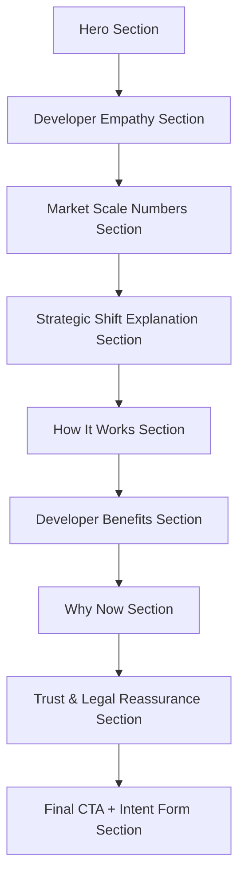

# Developer Onboarding Page - Design

This document outlines the wireframe and high-fidelity design for the Developer Onboarding Page, following a minimal, premium, and modern aesthetic.

## Wireframe



## High-Fidelity Design

### 1. Hero Section

**Layout:**
- A centered, full-width section with generous padding.
- A large, clean headline in a sans-serif typeface (e.g., Inter, SF Pro Display).
- A smaller subtext below the headline.
- A prominent, solid-color CTA button with rounded corners.
- A subtle, abstract background pattern.

**Typography:**
- Headline: 72px, bold
- Subtext: 24px, regular
- CTA: 18px, medium

**Color Palette:**
- Background: #F9FAFB (light gray)
- Headline: #111827 (dark gray)
- Subtext: #6B7280 (medium gray)
- CTA Background: #111827 (dark gray)
- CTA Text: #FFFFFF (white)

**Code Snippet:**
```html
<section class="bg-gray-50 py-32">
  <div class="container mx-auto text-center">
    <h1 class="text-7xl font-bold text-gray-900">
      What If One Property Could Unlock Capital From Hundreds of Buyers Instead of One?
    </h1>
    <p class="mt-4 text-2xl text-gray-500">
      Some developers are quietly using fractional ownership structures to access liquidity faster, reduce financial pressure, and expand demand — without discounting prices or changing how they build.
    </p>
    <div class="mt-8">
      <a href="#" class="inline-block bg-gray-900 text-white text-lg font-medium px-8 py-4 rounded-md">
        Explore How This Works for Developers
      </a>
    </div>
  </div>
</section>
```

### 2. Developer Empathy Section

**Layout:**
- A three-column grid with equal spacing between the columns.
- Each column contains a card with a simple line icon, a bold title, and a short description.
- The cards have a subtle hover effect (e.g., a slight lift or a change in border color).

**Typography:**
- Card Title: 24px, bold
- Card Description: 16px, regular

**Color Palette:**
- Background: #FFFFFF (white)
- Card Title: #111827 (dark gray)
- Card Description: #6B7280 (medium gray)
- Icon: #6B7280 (medium gray)

**Code Snippet:**
```html
<section class="py-32">
  <div class="container mx-auto">
    <div class="grid grid-cols-1 md:grid-cols-3 gap-8">
      <div class="p-8 rounded-md hover:shadow-lg transition-shadow">
        <svg><!-- icon --></svg>
        <h3 class="mt-4 text-2xl font-bold text-gray-900">Even strong projects experience temporary capital pressure</h3>
      </div>
      <div class="p-8 rounded-md hover:shadow-lg transition-shadow">
        <svg><!-- icon --></svg>
        <h3 class="mt-4 text-2xl font-bold text-gray-900">Sales velocity fluctuates across market cycles</h3>
      </div>
      <div class="p-8 rounded-md hover:shadow-lg transition-shadow">
        <svg><!-- icon --></svg>
        <h3 class="mt-4 text-2xl font-bold text-gray-900">Carrying costs quietly increase during slower phases</h3>
      </div>
    </div>
  </div>
</section>
```

### 3. Market Scale Numbers Section

**Layout:**
- A centered, full-width section with large numeric displays.
- Each number has a clear label below it.
- A thin, light gray line separates the numbers.

**Typography:**
- Number: 72px, bold
- Label: 18px, regular

**Color Palette:**
- Background: #F9FAFB (light gray)
- Number: #111827 (dark gray)
- Label: #6B7280 (medium gray)
- Separator: #E5E7EB (light gray)

**Code Snippet:**
```html
<section class="bg-gray-50 py-32">
  <div class="container mx-auto text-center">
    <div class="grid grid-cols-1 md:grid-cols-3 gap-8">
      <div>
        <p class="text-7xl font-bold text-gray-900">₹6-7 lakh crore</p>
        <p class="mt-2 text-lg text-gray-500">Worth of residential inventory remains unsold</p>
      </div>
      <div class="border-l border-gray-200">
        <p class="text-7xl font-bold text-gray-900">Locked Capital</p>
        <p class="mt-2 text-lg text-gray-500">A significant portion of this inventory is marketable</p>
      </div>
      <div class="border-l border-gray-200">
        <p class="text-7xl font-bold text-gray-900">Growing Interest</p>
        <p class="mt-2 text-lg text-gray-500">Household and HNI data shows growing interest</p>
      </div>
    </div>
  </div>
</section>
```

### 5. How It Works Section

**Layout:**
- A vertical roadmap-style layout with numbered steps.
- Each step has a simple icon and a brief text description.
- A subtle line connects the steps to show the flow.

**Typography:**
- Step Number: 24px, bold
- Step Text: 18px, regular

**Color Palette:**
- Background: #F9FAFB (light gray)
- Step Number: #111827 (dark gray)
- Step Text: #6B7280 (medium gray)
- Line: #E5E7EB (light gray)

**Code Snippet:**
```html
<section class="bg-gray-50 py-32">
  <div class="container mx-auto">
    <div class="text-center">
      <h2 class="text-4xl font-bold text-gray-900">How It Works</h2>
    </div>
    <div class="mt-16">
      <div class="flex flex-col md:flex-row justify-between items-center">
        <div class="flex flex-col items-center">
          <div class="w-16 h-16 rounded-full bg-gray-900 text-white flex items-center justify-center text-2xl font-bold">1</div>
          <p class="mt-4 text-lg text-gray-500 text-center">A specific property or unit is identified for fractional participation.</p>
        </div>
        <div class="w-full h-px md:w-auto md:h-px bg-gray-200 my-8 md:my-0"></div>
        <div class="flex flex-col items-center">
          <div class="w-16 h-16 rounded-full bg-gray-900 text-white flex items-center justify-center text-2xl font-bold">2</div>
          <p class="mt-4 text-lg text-gray-500 text-center">The asset is placed into a dedicated holding entity (SPV).</p>
        </div>
        <div class="w-full h-px md:w-auto md:h-px bg-gray-200 my-8 md:my-0"></div>
        <div class="flex flex-col items-center">
          <div class="w-16 h-16 rounded-full bg-gray-900 text-white flex items-center justify-center text-2xl font-bold">3</div>
          <p class="mt-4 text-lg text-gray-500 text-center">Ownership of that entity is opened to multiple smaller investors.</p>
        </div>
        <div class="w-full h-px md:w-auto md:h-px bg-gray-200 my-8 md:my-0"></div>
        <div class="flex flex-col items-center">
          <div class="w-16 h-16 rounded-full bg-gray-900 text-white flex items-center justify-center text-2xl font-bold">4</div>
          <p class="mt-4 text-lg text-gray-500 text-center">Capital is raised from a wider pool without public discounting.</p>
        </div>
        <div class="w-full h-px md:w-auto md:h-px bg-gray-200 my-8 md:my-0"></div>
        <div class="flex flex-col items-center">
          <div class="w-16 h-16 rounded-full bg-gray-900 text-white flex items-center justify-center text-2xl font-bold">5</div>
          <p class="mt-4 text-lg text-gray-500 text-center">Development, branding, leasing, and execution remain fully with the developer.</p>
        </div>
      </div>
    </div>
  </div>
</section>
```

### 6. Developer Benefits Section

**Layout:**
- A grid of benefit cards with no borders.
- Each card has a bold statement and a lightweight subtext.
- A gentle shadow appears on hover to provide feedback.

**Typography:**
- Statement: 24px, bold
- Subtext: 16px, regular

**Color Palette:**
- Background: #FFFFFF (white)
- Statement: #111827 (dark gray)
- Subtext: #6B7280 (medium gray)

**Code Snippet:**
```html
<section class="py-32">
  <div class="container mx-auto">
    <div class="text-center">
      <h2 class="text-4xl font-bold text-gray-900">Developer Benefits</h2>
    </div>
    <div class="grid grid-cols-1 md:grid-cols-2 lg:grid-cols-3 gap-8 mt-16">
      <div class="p-8 rounded-md hover:shadow-lg transition-shadow">
        <h3 class="text-2xl font-bold text-gray-900">Liquidity flexibility without price erosion</h3>
      </div>
      <div class="p-8 rounded-md hover:shadow-lg transition-shadow">
        <h3 class="text-2xl font-bold text-gray-900">Pricing integrity preserved</h3>
      </div>
      <div class="p-8 rounded-md hover:shadow-lg transition-shadow">
        <h3 class="text-2xl font-bold text-gray-900">Demand expansion without repositioning</h3>
      </div>
      <div class="p-8 rounded-md hover:shadow-lg transition-shadow">
        <h3 class="text-2xl font-bold text-gray-900">Operational control remains unchanged</h3>
      </div>
      <div class="p-8 rounded-md hover:shadow-lg transition-shadow">
        <h3 class="text-2xl font-bold text-gray-900">Selective adoption — pilot one asset, not everything</h3>
      </div>
    </div>
  </div>
</section>
```

### 7. Why Now Section

**Layout:**
- A full-width section with a short headline and crisp bullet points.
- Subtle icons can be used to represent trends.

**Typography:**
- Headline: 36px, bold
- Bullet Points: 18px, regular

**Color Palette:**
- Background: #F9FAFB (light gray)
- Headline: #111827 (dark gray)
- Bullet Points: #6B7280 (medium gray)

**Code Snippet:**
```html
<section class="bg-gray-50 py-32">
  <div class="container mx-auto text-center">
    <h2 class="text-4xl font-bold text-gray-900">Why Now?</h2>
    <div class="mt-8 max-w-3xl mx-auto">
      <ul class="space-y-4 text-lg text-gray-500">
        <li>Market reports show increasing interest in fractional and alternative real estate participation models.</li>
        <li>Wealth data indicates rising allocation toward real assets among emerging investors.</li>
        <li>Digital payments and compliance infrastructure now support structured participation at scale.</li>
      </ul>
    </div>
  </div>
</section>
```

### 8. Trust & Legal Reassurance Section

**Layout:**
- A light gray container with left-aligned text.
- Small checkmark icons next to each trust statement.
- This section is visually quieter to convey calm assurance.

**Typography:**
- Headline: 36px, bold
- Trust Statements: 18px, regular

**Color Palette:**
- Background: #FFFFFF (white)
- Container Background: #F9FAFB (light gray)
- Headline: #111827 (dark gray)
- Trust Statements: #6B7280 (medium gray)
- Icon: #10B981 (green)

**Code Snippet:**
```html
<section class="py-32">
  <div class="container mx-auto">
    <div class="bg-gray-50 p-16 rounded-md">
      <h2 class="text-4xl font-bold text-gray-900">Trust, Legality & Contribution Deed</h2>
      <div class="mt-8">
        <ul class="space-y-4 text-lg text-gray-500">
          <li class="flex items-start">
            <svg class="w-6 h-6 text-green-500 mr-2 shrink-0"><!-- checkmark icon --></svg>
            <span>Assets are transferred using standard contribution or sale mechanisms.</span>
          </li>
          <li class="flex items-start">
            <svg class="w-6 h-6 text-green-500 mr-2 shrink-0"><!-- checkmark icon --></svg>
            <span>Ownership sits within a clean, single-purpose entity.</span>
          </li>
          <li class="flex items-start">
            <svg class="w-6 h-6 text-green-500 mr-2 shrink-0"><!-- checkmark icon --></svg>
            <span>Investor participation is structured, not fragmented.</span>
          </li>
          <li class="flex items-start">
            <svg class="w-6 h-6 text-green-500 mr-2 shrink-0"><!-- checkmark icon --></svg>
            <span>All documentation is reviewable by developer legal and finance teams before proceeding.</span>
          </li>
        </ul>
      </div>
    </div>
  </div>
</section>
```

### 9. Final CTA + Intent Form Section

**Layout:**
- A two-column layout with the CTA on the left and the form on the right.
- The form fields have generous spacing and minimal placeholder text.
- Two clean, primary CTA buttons at the bottom of the form.

**Typography:**
- Headline: 36px, bold
- Form Labels: 16px, medium
- Button Text: 18px, medium

**Color Palette:**
- Background: #F9FAFB (light gray)
- Headline: #111827 (dark gray)
- Form Labels: #374151 (dark gray)
- Input Border: #D1D5DB (light gray)
- CTA Background: #111827 (dark gray)
- CTA Text: #FFFFFF (white)

**Code Snippet:**
```html
<section class="bg-gray-50 py-32">
  <div class="container mx-auto">
    <div class="grid grid-cols-1 md:grid-cols-2 gap-16 items-center">
      <div>
        <h2 class="text-4xl font-bold text-gray-900">Join Developer Early Access</h2>
        <p class="mt-4 text-lg text-gray-500">Discuss a pilot property or learn more about the structure.</p>
      </div>
      <div>
        <form class="space-y-8">
          <div>
            <label for="name" class="block text-sm font-medium text-gray-700">Name</label>
            <input type="text" id="name" class="mt-1 block w-full px-4 py-3 border border-gray-300 rounded-md">
          </div>
          <div>
            <label for="company" class="block text-sm font-medium text-gray-700">Company</label>
            <input type="text" id="company" class="mt-1 block w-full px-4 py-3 border border-gray-300 rounded-md">
          </div>
          <div>
            <label for="city" class="block text-sm font-medium text-gray-700">City</label>
            <input type="text" id="city" class="mt-1 block w-full px-4 py-3 border border-gray-300 rounded-md">
          </div>
          <div>
            <label for="role" class="block text-sm font-medium text-gray-700">Role</label>
            <input type="text" id="role" class="mt-1 block w-full px-4 py-3 border border-gray-300 rounded-md">
          </div>
          <div>
            <label for="property-type" class="block text-sm font-medium text-gray-700">Property Type</label>
            <input type="text" id="property-type" class="mt-1 block w-full px-4 py-3 border border-gray-300 rounded-md">
          </div>
          <div>
            <label class="block text-sm font-medium text-gray-700">Interest Type</label>
            <div class="mt-2 space-y-2">
              <div class="flex items-center">
                <input id="pilot" type="checkbox" class="h-4 w-4 text-gray-900 border-gray-300 rounded">
                <label for="pilot" class="ml-2 block text-sm text-gray-900">Exploring a pilot property</label>
              </div>
              <div class="flex items-center">
                <input id="structure" type="checkbox" class="h-4 w-4 text-gray-900 border-gray-300 rounded">
                <label for="structure" class="ml-2 block text-sm text-gray-900">Understanding the structure</label>
              </div>
              <div class="flex items-center">
                <input id="collaboration" type="checkbox" class="h-4 w-4 text-gray-900 border-gray-300 rounded">
                <label for="collaboration" class="ml-2 block text-sm text-gray-900">Long-term collaboration</label>
              </div>
              <div class="flex items-center">
                <input id="informed" type="checkbox" class="h-4 w-4 text-gray-900 border-gray-300 rounded">
                <label for="informed" class="ml-2 block text-sm text-gray-900">Staying informed</label>
              </div>
            </div>
          </div>
          <div>
            <button type="submit" class="w-full bg-gray-900 text-white px-8 py-4 rounded-md">Submit</button>
          </div>
        </form>
      </div>
    </div>
  </div>
</section>
```

## Mobile Responsive Design

All sections are designed to be responsive and will stack vertically on mobile devices. The grid layouts will wrap to a single column, and the typography and spacing will be adjusted for smaller screens.

### 4. Strategic Shift Explanation Section

**Layout:**
- A two-column layout with a minimal icon on the left and a headline and bullet points on the right.
- The cards have a very subtle shadow and crisp corners.

**Typography:**
- Headline: 36px, bold
- Bullet Points: 18px, regular

**Color Palette:**
- Background: #FFFFFF (white)
- Headline: #111827 (dark gray)
- Bullet Points: #6B7280 (medium gray)
- Icon: #6B7280 (medium gray)

**Code Snippet:**
```html
<section class="py-32">
  <div class="container mx-auto">
    <div class="grid grid-cols-1 md:grid-cols-2 gap-16 items-center">
      <div>
        <svg><!-- icon --></svg>
      </div>
      <div>
        <h2 class="text-4xl font-bold text-gray-900">Unlocking a Larger Buyer Segment — Without Changing Your Project DNA</h2>
        <ul class="mt-8 space-y-4 text-lg text-gray-500">
          <li>A growing investor segment wants real estate exposure but cannot buy full units.</li>
          <li>Fractional structures allow participation without altering your target customer.</li>
          <li>ComfHutt exists to organize this demand professionally and conservatively.</li>
        </ul>
      </div>
    </div>
  </div>
</section>
```
